# Sistem Manajemen Inventaris Barang (E-Inventory)

## Deskripsi Proyek
Proyek ini adalah sistem informasi **Manajemen Inventaris Barang (E-Inventory)** yang dikembangkan sebagai tugas akhir mata kuliah Pemrograman Web 2. Aplikasi ini dirancang untuk mengelola data barang, kategori barang, stok, supplier, dan memantau status persediaan. 

Sistem dibangun menggunakan arsitektur modern yang memisahkan antara backend dan frontend:
- **Backend API**: Menggunakan framework CodeIgniter 4 (PHP) yang difungsikan penuh sebagai RESTful API Controller.
- **Frontend SPA**: Menggunakan VueJS 3 via CDN yang digabungkan dengan desain UI utilitas dari TailwindCSS.

---

## 1. Skema Relasi Database
Berikut adalah struktur relasi tabel dalam database `e_inventory` (berisi tabel `users`, `categories`, `products`, dan `transactions`):

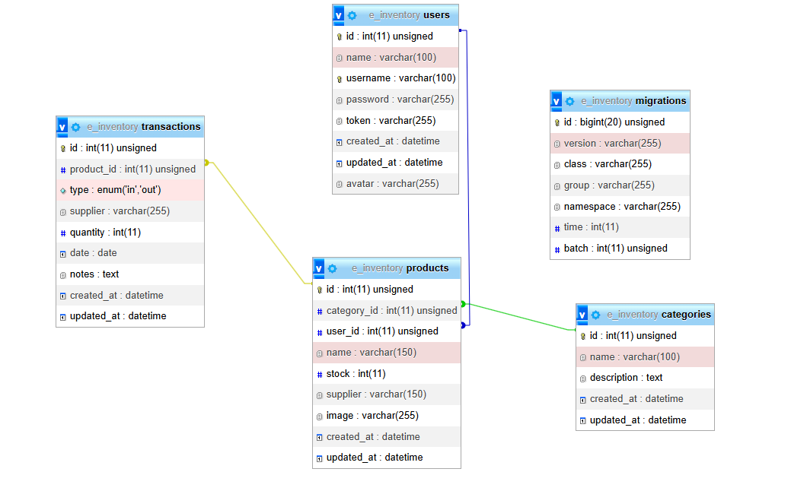

---

## 2. Pengujian Keamanan API (Error 401 Unauthorized)
Endpoint manipulasi data pada API ini dilindungi oleh **CodeIgniter Filters**. Berikut adalah hasil uji coba akses API secara ilegal melalui aplikasi Postman yang mengembalikan pesan peringatan karena absennya *Authorization Bearer Token*.

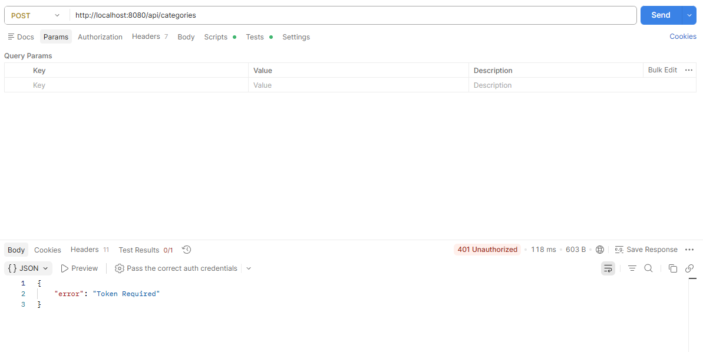

---

## 3. Antarmuka Pengguna (UI) Frontend
Tampilan aplikasi dikembangkan menggunakan kelas utilitas modern **TailwindCSS** dengan tema responsif.

### Halaman Login
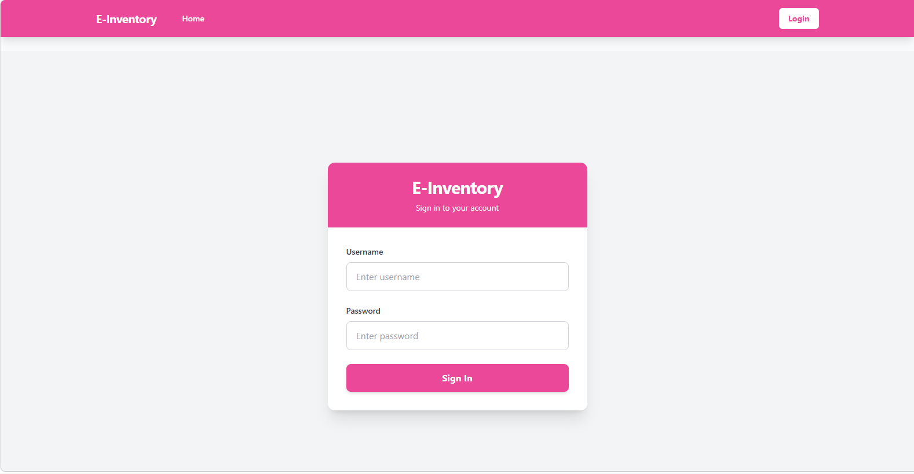

### Dashboard Admin & Profile
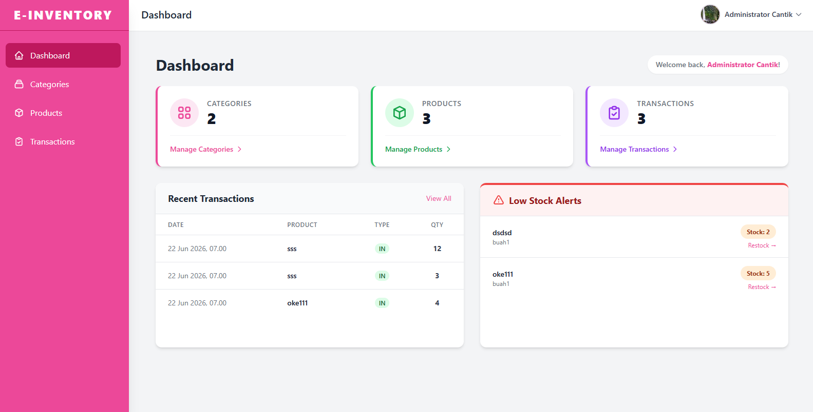
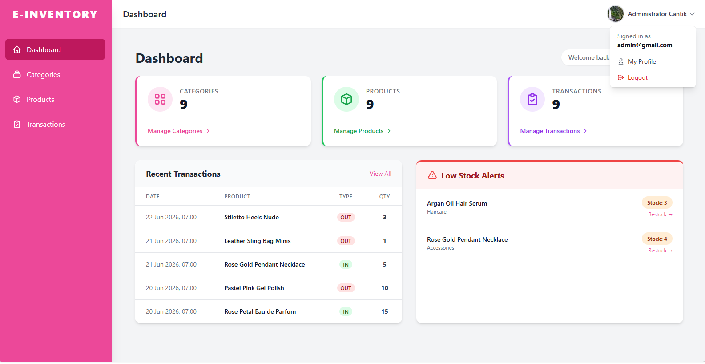

### Master Data: Kategori
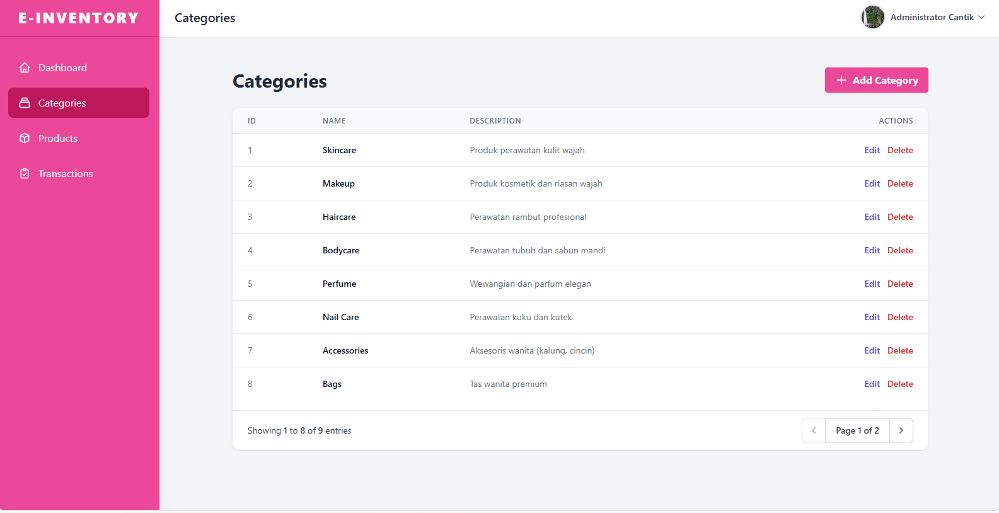
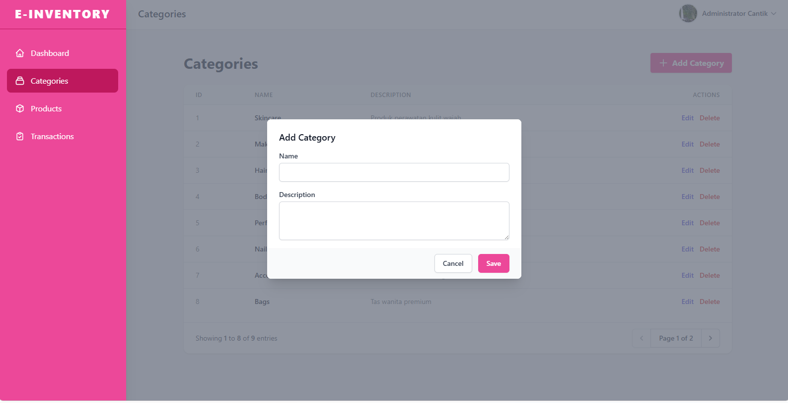
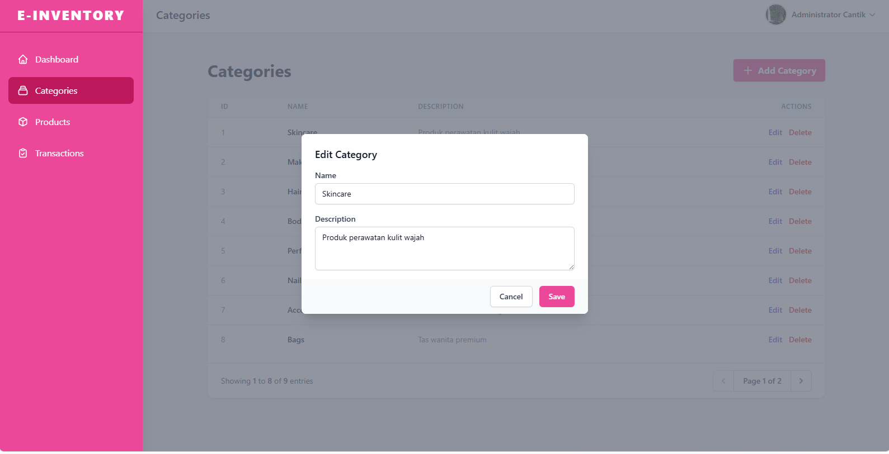
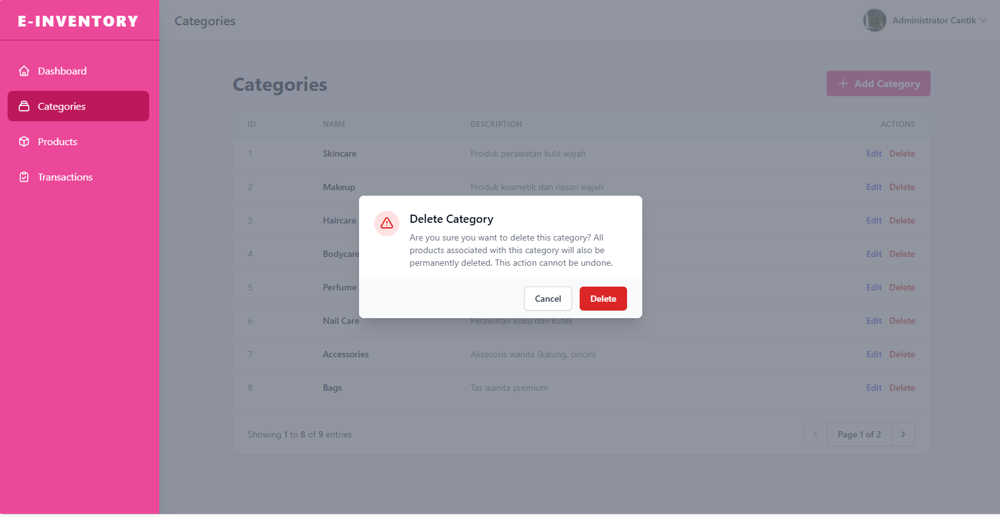

### Master Data: Produk
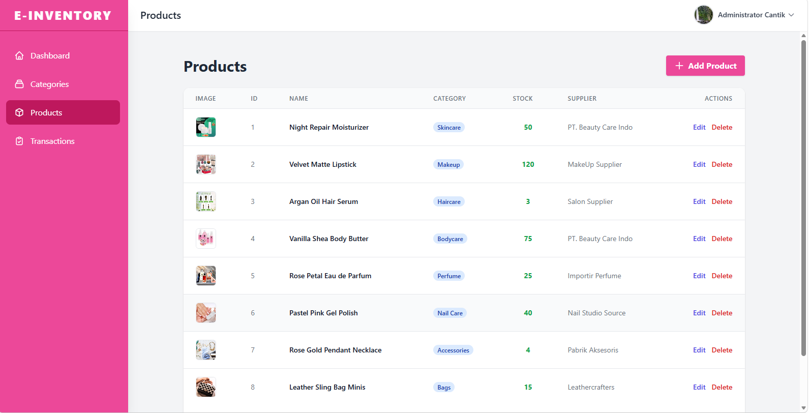
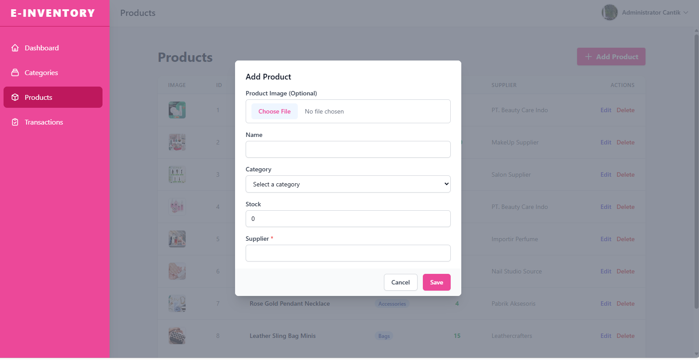
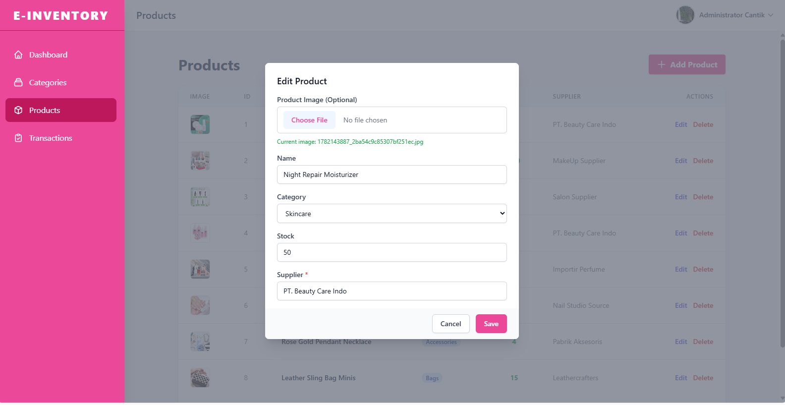
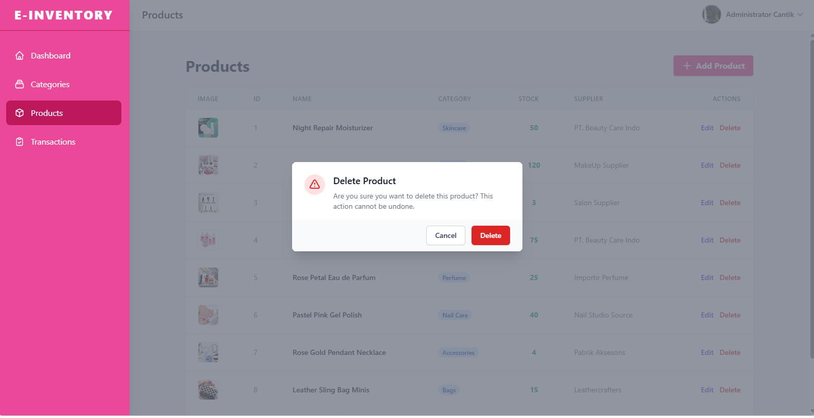

### Data Transaksi (Barang Masuk/Keluar)
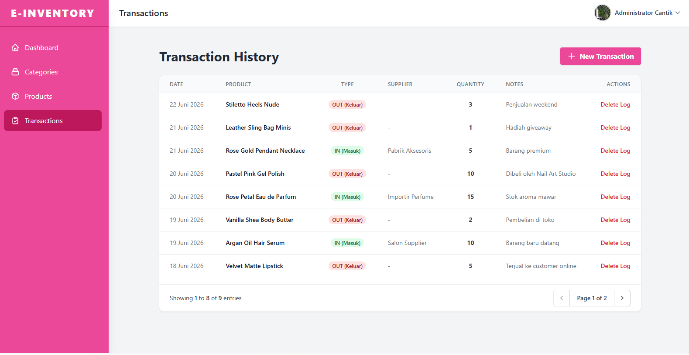
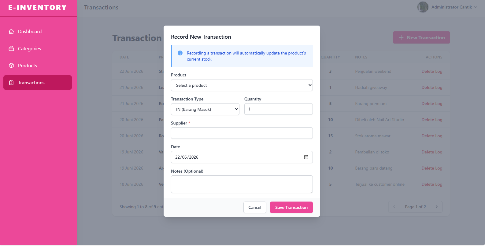
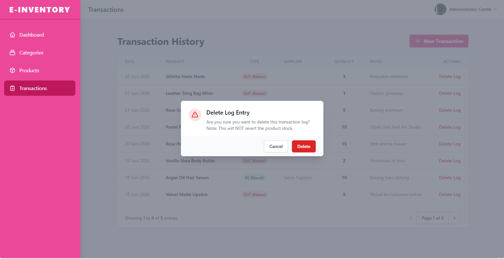

---

## 4. Panduan Instalasi Lokal
Berikut adalah panduan singkat untuk menjalankan proyek ini di komputer lokal Anda:

### Menjalankan Backend API (CodeIgniter 4)
1. Pastikan Anda telah menginstal PHP dan Composer di komputer Anda, serta menyalakan modul MySQL (misalnya melalui XAMPP,laragon).
2. Buat database baru bernama `e_inventory` di MySQL.
3. Buka terminal/Command Prompt, lalu arahkan ke direktori backend:
   ```bash
   cd backend-api
   ```
4. Jalankan perintah migrasi dan seeder untuk menyusun tabel dan akun default admin:
   ```bash
   php spark migrate
   php spark db:seed UserSeeder
   ```
   *(Catatan: Akun login default -> Username: **admin**, Password: **password**)*
5. Nyalakan server API lokal:
   ```bash
   php spark serve
   ```
   *Server backend akan menyala di `http://localhost:8080`.*

### Menjalankan Frontend SPA (VueJS + TailwindCSS)
1. Buka terminal baru dan arahkan ke direktori `frontend-spa`:
   ```bash
   cd frontend-spa
   ```
2. Jalankan perintah ini untuk menyalakan server lokal secara otomatis menggunakan *npx http-server*:
   ```bash
   npm run dev
   ```
3. Akses frontend di browser Anda melalui tautan yang muncul (biasanya `http://localhost:8081` atau `http://127.0.0.1:8081`).

---

## 5. Tautan Penting

- 🔗 **Link Demo Aplikasi**: https://github.com/adorablekey/UAS_Web2_312410350_Keysia-Nurhayati-br-Panjaitan.git
- 🎥 **Link Video Presentasi**: 
